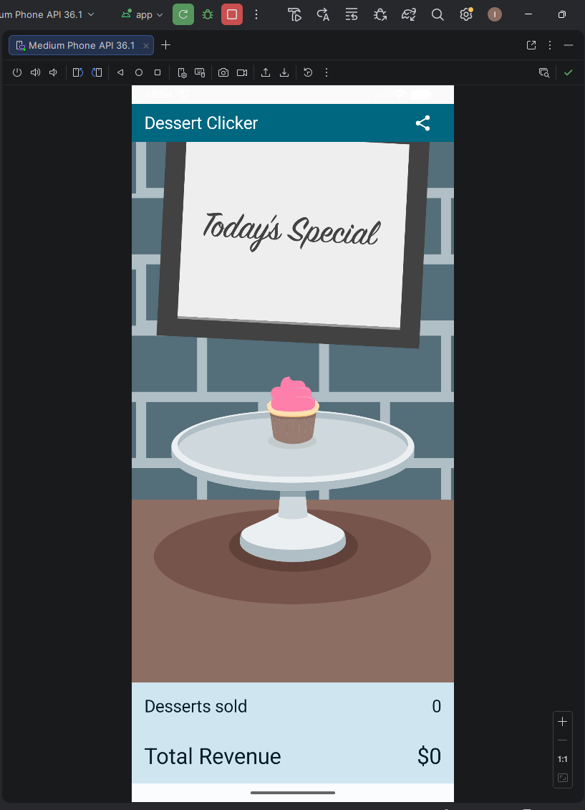
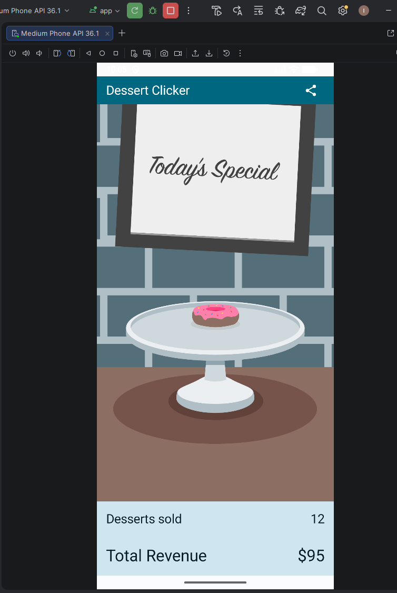
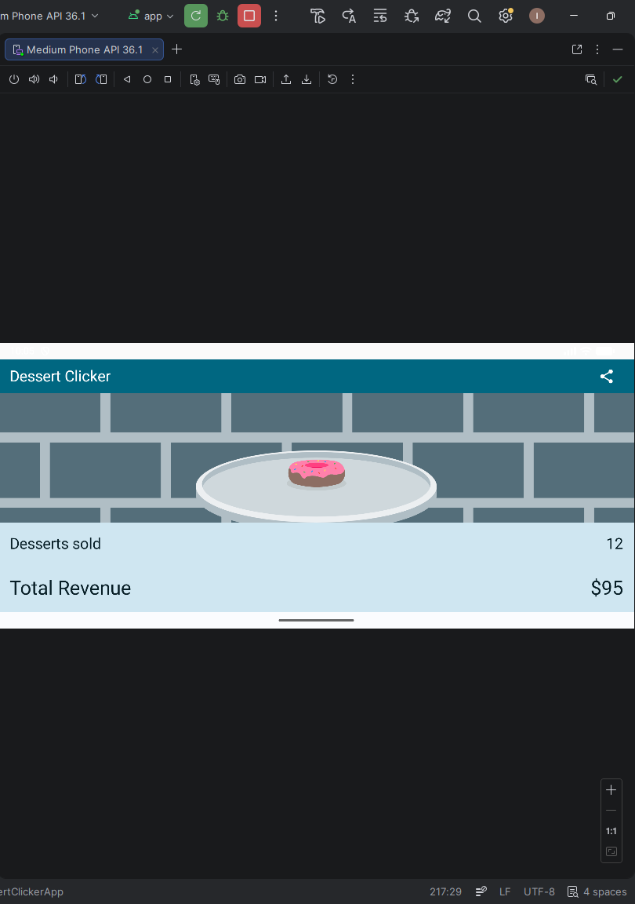

# 🍰 Dessert Clicker – Android Activity Lifecycle

# 🍰 Dessert Clicker – Android Activity Lifecycle

This project is created as part of an Android development assignment focused on understanding the **Activity Lifecycle** and how Android manages activity states.

The application is based on the **Dessert Clicker codelab** from Google and demonstrates how lifecycle callbacks work and how to preserve state during configuration changes.

---

# 📱 Application Overview

Dessert Clicker is a simple interactive app where users tap on desserts to "sell" them.

Each click:
- Increases the number of desserts sold
- Adds revenue based on the dessert price
- Displays the next dessert after reaching a production threshold

The app also allows users to **share their progress** using the Share button.

---

# ⚙️ Features

✔ Dessert click interaction  
✔ Dynamic dessert changes  
✔ Revenue tracking  
✔ Share button functionality  
✔ Lifecycle logging using **Logcat**  
✔ Configuration change handling (screen rotation)  
✔ State preservation using **rememberSaveable**  
✔ UI built with **Jetpack Compose + Material 3**

---

# 🔄 Activity Lifecycle

The following lifecycle methods are implemented and logged in **Logcat**:
onCreate()
onStart()
onResume()
onPause()
onStop()
onRestart()
onDestroy()

These logs allow monitoring how Android manages the activity lifecycle during:

- App start
- App background/foreground transitions
- App closure
- Configuration changes

---

# 🔁 Configuration Changes

When the device rotates, Android **destroys and recreates the Activity**.

To prevent data loss, the following state variables use:
rememberSaveable

This ensures that the following values persist after rotation:

- Desserts sold
- Total revenue
- Current dessert image

---

# 🖼 Screenshots

## Main Screen

## Clicking Desserts

## Screen Rotation Handling

## Logcat Lifecycle Events

---

# 🛠 Technologies Used

- Kotlin
- Android Studio
- Jetpack Compose
- Material 3
- Android Activity Lifecycle
- Logcat

---

# 📚 Reference

Google Android Codelab:

https://developer.android.com/codelabs/basic-android-kotlin-compose-activity-lifecycle

---

# 👨‍💻 Author

Ivan Blazeski